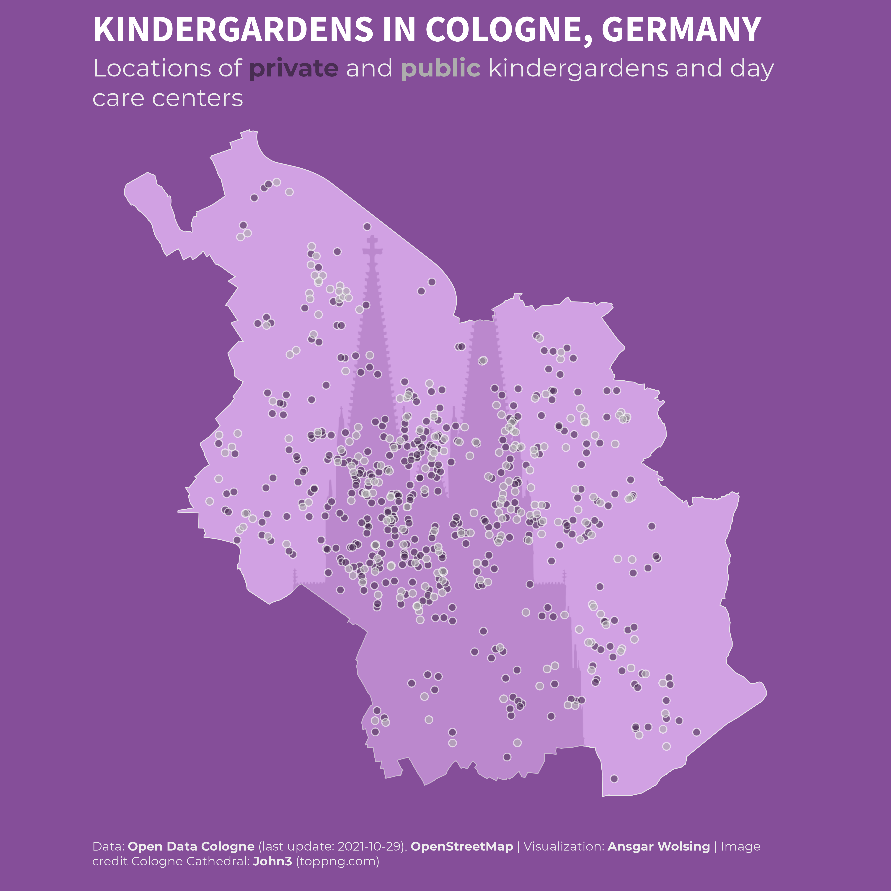
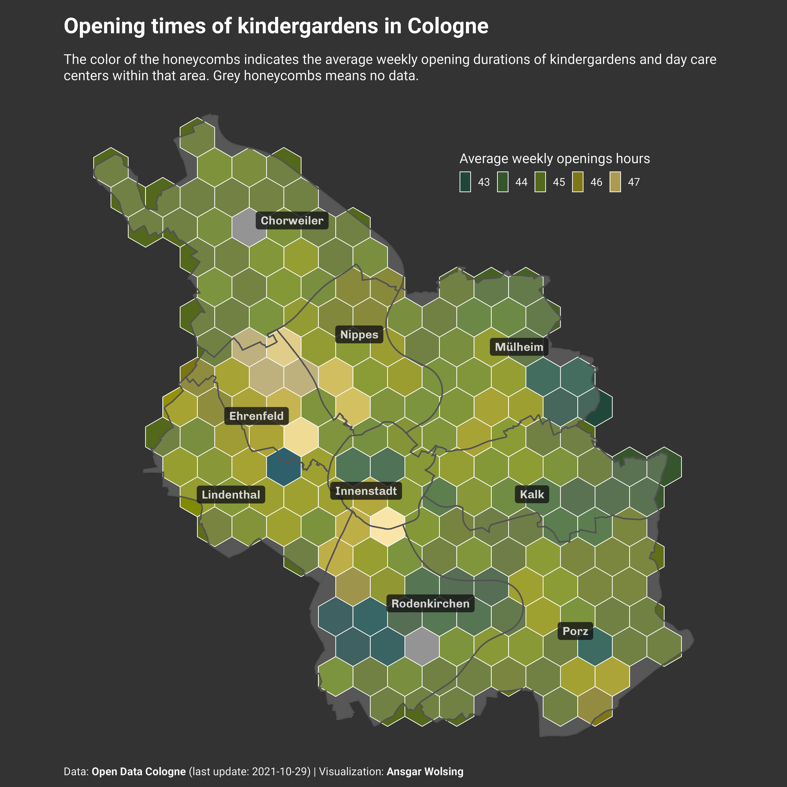

```{r setup, include=FALSE}
knitr::opts_chunk$set(echo = FALSE,
                      fig.retina = TRUE)
```

## The Challenge

Github repo: https://github.com/tjukanovt/30DayMapChallenge


## The Maps

### Day 1: Points

A map of the locations of all kindergardens and day care centers in Cologne, Germany.



### Day 2: Lines

The Rhine


### Day 3: Polygons

Voronoi tesselation to find the nearest (semi-)professional football team for each point in Cologne


### Day 4: Hexagons

Opening times / availabilities of kindergardens in Cologne




