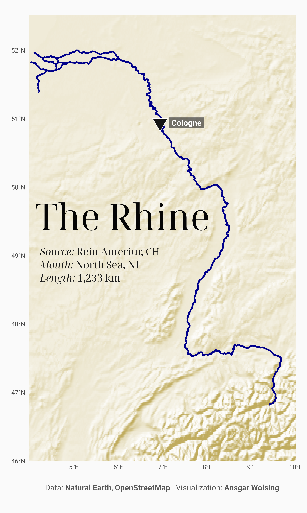
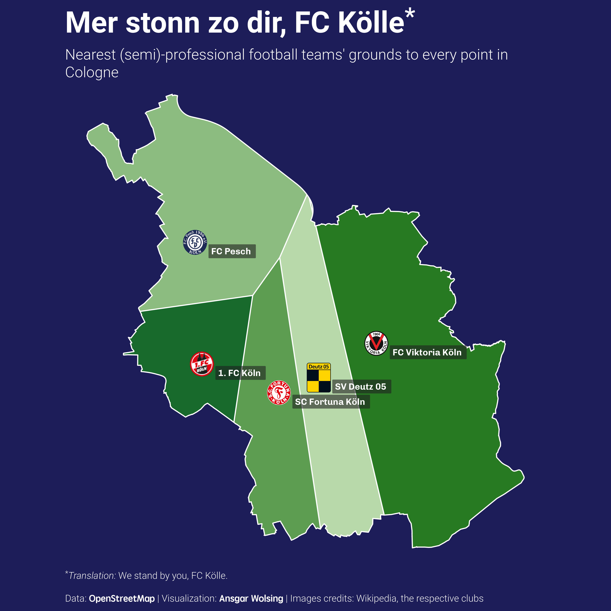
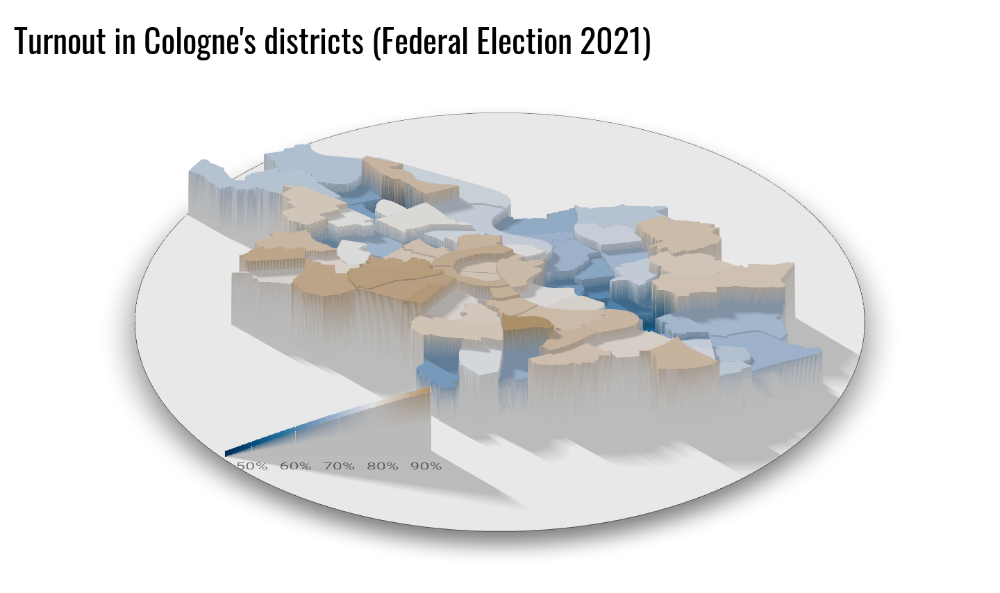
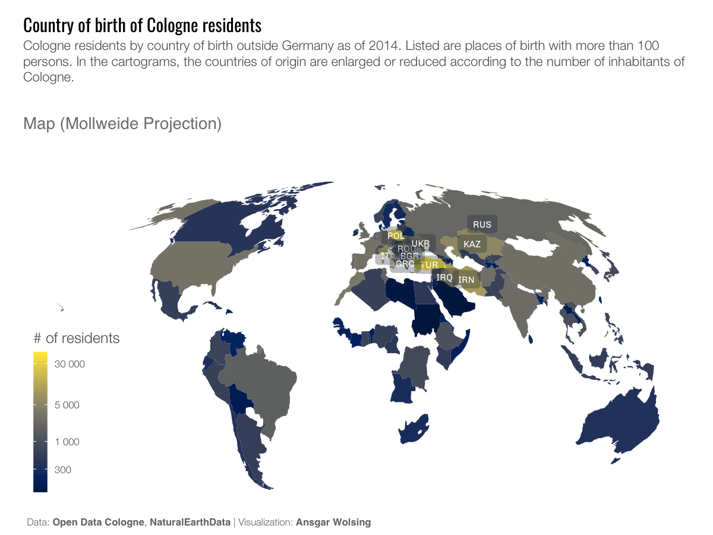
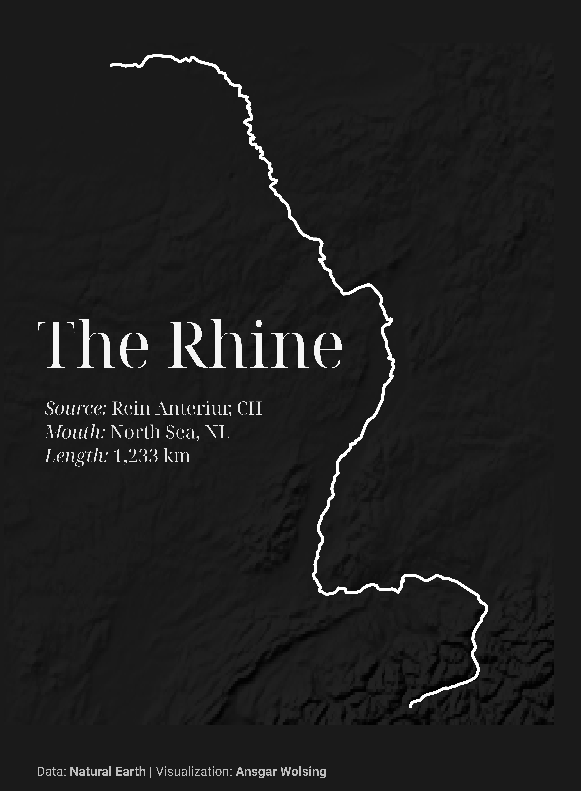

\#30DayMapChallenge 2021
================

## The Challenge

Github repo: <https://github.com/tjukanovt/30DayMapChallenge>

## The Maps

### Day 1: Points

A map of the locations of all kindergardens and day care centers in
Cologne, Germany.

### Day 2: Lines

The Rhine

### Day 3: Polygons

Voronoi tesselation to find the nearest (semi-)professional football
team for each point in Cologne

### Day 4: Hexagons

Opening times / availabilities of kindergardens in Cologne

### Day 5: Data Challenge 1: OpenStreetMap

Bike lanes in Cologne, Germany, colored by surface type

### Day 6: Red

A tile grid map of vote shares of the Social Democrats (SPD) in the
German Federal Election 2021 in each district in Cologne.

#### English

#### German

### Day 7: Green

A tile grid map of vote shares of the Green Party (Bündnis 90 / Die
Grünen) in the German Federal Election 2021 in each district in Cologne.

### Day 8: Blue

Average housing space the districts of Cologne

### Day 9: Monochrome

Streets of Cologne

### Day 10: Raster

### Day 11: 3D

### Day 12: Population

### Day 13: Data challenge 2: Natural Earth

Day 2 (Lines) revisited, but using only Natural Earth data.

### Day 14: Map using a new tool

Map created with [Datawrapper](https://www.datawrapper.com). The tile
grid, created by @z3tt and me, can be downloaded from

